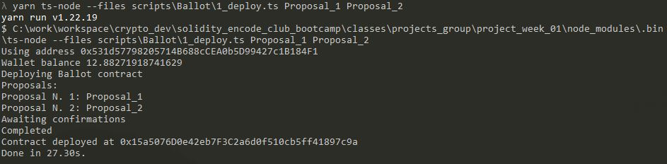
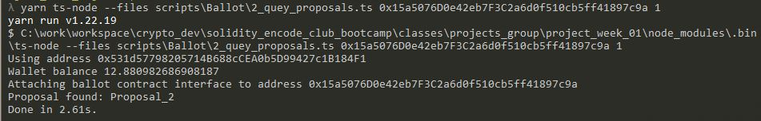
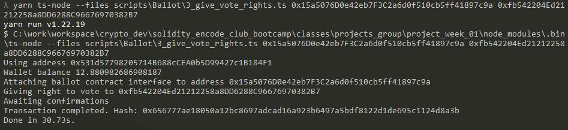
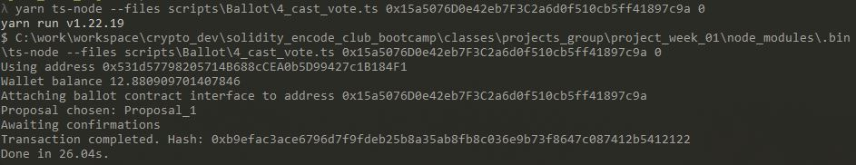
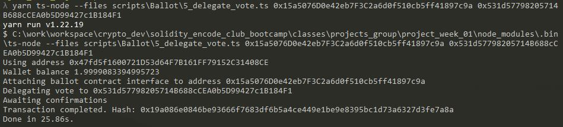
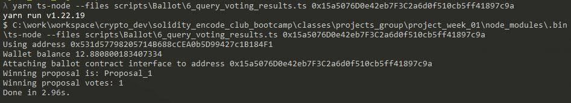

# Weekend Project - 1
* Form groups of 3 to 5 students
* Structure scripts to
  * Deploy
  * Query proposals
  * Give vote right passing an address as input
  * Cast a vote to a ballot passing contract address and proposal as input and using the wallet in environment
  * Delegate my vote passing  user address as input and using the wallet in environment
  * Query voting result and print to console
* Publish the project in Github
* Run the scripts with a set of proposals, cast and delegate votes and inspect results
* Write a report detailing the addresses, transaction hashes, description of the operation script being executed and console output from script execution for each step (Deployment, giving voting rights, casting/delegating and querying results).
* (Extra) Use TDD methodology

# Scripts
* 1_deploy.ts 
* 2_quey_proposals.ts
* 3_give_vote_rights.ts
* 4_cast_vote.ts
* 5_delegate_vote.ts
* 6_query_voting_results.ts

# How to use

## Deploy
script: 1_deploy.ts {list_of_proposals}

`yarn ts-node --files scripts\Ballot\1_deploy.ts Proposal_1 Proposal_2`

## Query Proposals 

script: 2_quey_proposals.ts {address_contract_ballot} {index_proposal}

`yarn ts-node --files scripts\Ballot\2_quey_proposals.ts 0x15a5076D0e42eb7F3C2a6d0f510cb5ff41897c9a 1`

## Give vote right passing an address as input

script: 3_give_vote_rights.ts {address_contract_ballot} {address_to_give_rights}

`yarn ts-node --files scripts\Ballot\3_give_vote_rights.ts 0x15a5076D0e42eb7F3C2a6d0f510cb5ff41897c9a 0xfb542204Ed21212258a8DD6288C96676970382B7`

## Cast a vote to a ballot passing contract address and proposal as input and using the wallet in environment

script: 4_cast_vote.ts {address_contract_ballot} {index_proposal}

`yarn ts-node --files scripts\Ballot\4_cast_vote.ts 0x15a5076D0e42eb7F3C2a6d0f510cb5ff41897c9a 0`

## Delegate my vote passing  user address as input and using the wallet in environment

script: 5_delegate_vote.ts {address_contract_ballot} {address_to_delegate}

`yarn ts-node --files scripts\Ballot\5_delegate_vote.ts 0x15a5076D0e42eb7F3C2a6d0f510cb5ff41897c9a 0x531d57798205714B688cCEA0b5D99427c1B184F1`

## Query voting result and print to console

script: 6_query_voting_results.ts {address_contract_ballot}

`yarn ts-node --files scripts\Ballot\6_query_voting_results.ts 0x15a5076D0e42eb7F3C2a6d0f510cb5ff41897c9a`

